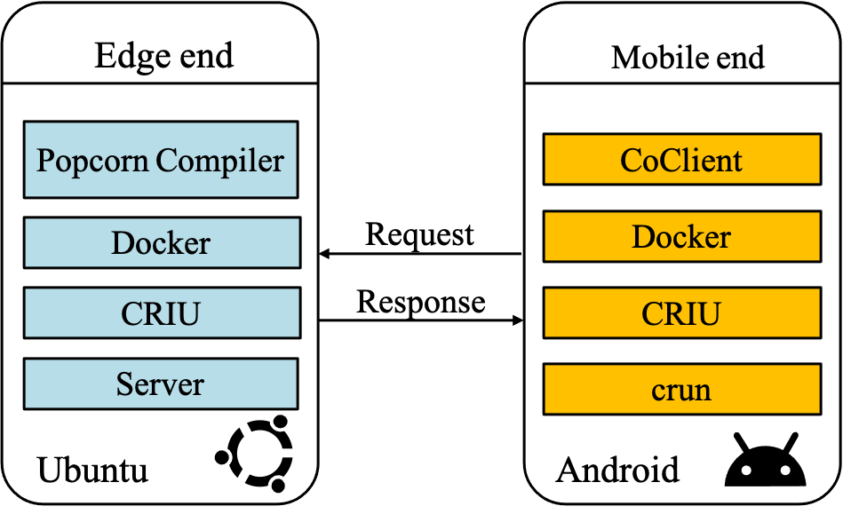
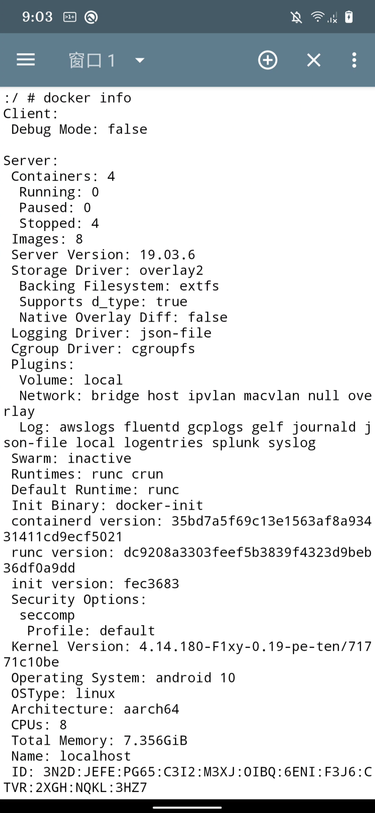
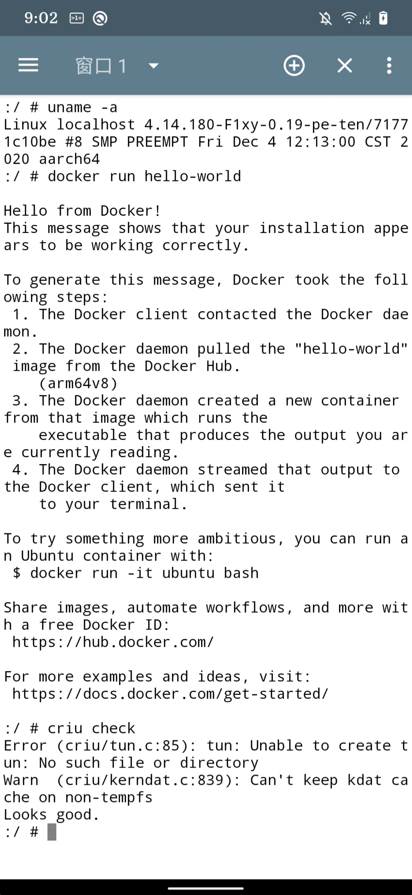
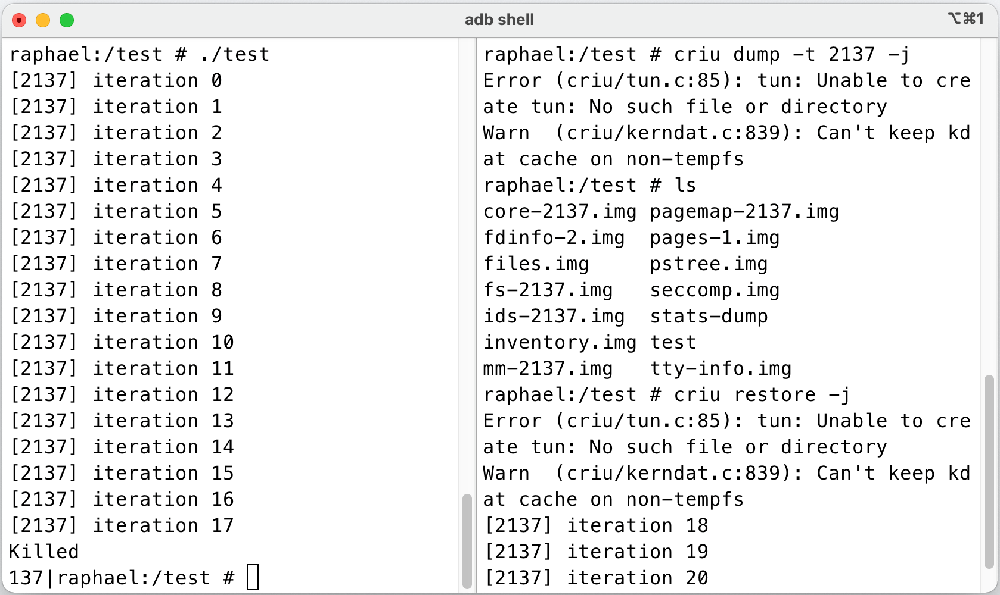
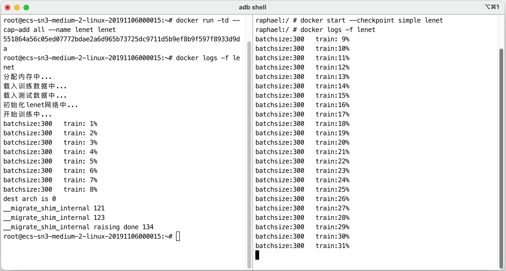

# Android Container
**English** | [中文](README_CN.md)

This project is used to run Linux containers in Android, such as Docker, Podman, etc. And it can migrate X86-based containers to the Android system to achieve cross-architecture container migration. The project needs to compile the Android source code and modify the kernel source code, so you need to understand AOSP compilation. You can use this project to run a complete container in the Android operating system and be able to use normal container functions.

-----

This project uses the Android smartphone Redmi K20 Pro as the experimental device.



## Project Directory

```
├── CoClient # Android client, used to manage containers in Android
│
├── README.md
├── README_CN.md
├── backend # Cross-architecture migration backend service program
│ ├── README.md
│ ├── README_EN.md
│ ├── backend.py
│ ├── container_migrate.py
│ ├── docker-popcorn-notify
│ ├── image_migrate.py
│ ├── mnt.py
│ └── recode.sh
├── criu # Use criu module in Android
│
├── docker # Run Docker container in Android
│ ├── README.md
│ ├── README_CN.md
│ ├── containerd
│ ├── containerd-shim
│ ├── ctr
│ ├── docker
│ ├── docker-init
│ ├── docker-proxy
│ ├── dockerd
│ └── runc
├── files  # Android total cgroup configuration file and docker startup script, diff files.
│   ├── aosp.diff
│   ├── cgroups.json
│   ├── dockerd.sh
│   ├── kernel.diff
│   └── raphael_defconfig
├── migration # Cross-architecture migration related
│   ├── README.md
│   ├── README_CN.md
│   ├── build-tar-static.sh
│   └── tar
├── picture # effect picture
│   ├── 1.png
│   └── 2.png
└── pixel-OS # Compile pixel os 
    ├── README.md
    └── README_CN.md
```

### Step

1. Enter the pixel-OS directory and compile the PixelExperience source code.
2. Enter the docker directory, modify the Android kernel source code, and port docker to the Android operating system.
3. Enter the criu directory, modify the Android kernel source code, and port criu to the Android operating system.
4. Enter the migration directory and modify the Android kernel source code so that Android supports cross-architecture migration.
5. Enter the backend directory and use the ubuntu back-end service program to conduct cross-architecture migration experiments.
6. Enter the CoClient directory and use the Android application to manage the Android container.


**note! ! !** If you don't know how to modify the kernel source code, you can refer to the modified kernel configuration file and the diff file generated by modifying the Android kernel source code in the files directory.

### Effect

**1. The rendering of the container running in Android.**

<table>
  <tr>
    <td>Docker info</td>
     <td>hello-world container and criu</td>
  </tr>
  <tr>
    <td></td>
    <td></td>
  </tr>
 </table>

**2. The rendering of the criu on android platform, simple looper experiment**



**3. The rendering of the cross-architecture container migration**

On the left is the container in the ubuntu operating system, and on the right is the container in Android. It can be seen that the container in Android continues to run after the container state in ubuntu, achieving the purpose of cross-architecture migration.

