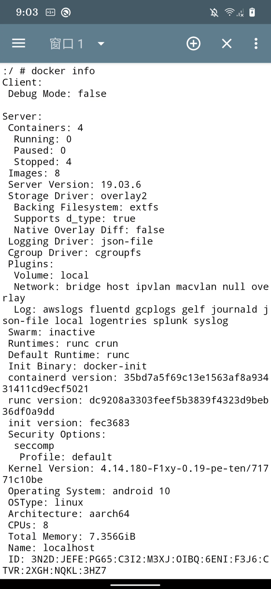
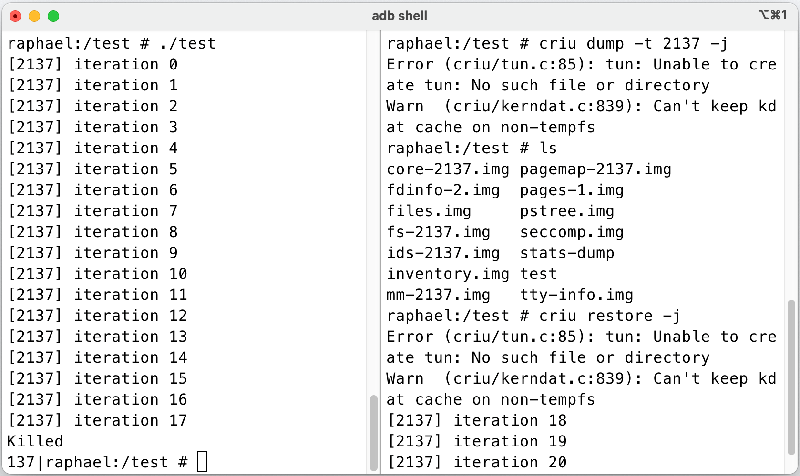

# 安卓容器

这个项目用于在安卓系统中运行Linux容器，比如Docker、Podman等。并且能够将X86架构的容器迁移到安卓系统中，实现跨架构容器迁移。项目需要编译安卓源码、修改内核源码，因此你需要对AOSP的编译有所了解。你可以使用该项目在安卓操作系统中运行一个完整的容器，能够使用正常的容器功能。

------

本项目使用安卓智能手机Redmi K20 Pro作为实验设备。

## 项目目录

```
├── CoClient    # 安卓客户端，用于管理安卓中的容器
│   
├── README.md
├── README_CN.md
├── backend # 跨架构迁移后端服务程序
│   ├── README.md
│   ├── README_EN.md
│   ├── backend.py
│   ├── container_migrate.py
│   ├── docker-popcorn-notify
│   ├── image_migrate.py
│   ├── mnt.py
│   └── recode.sh
├── criu # 安卓中使用criu模块
│  
├── docker # 安卓中运行Docker容器
│   ├── README.md
│   ├── README_CN.md
│   ├── containerd
│   ├── containerd-shim
│   ├── ctr
│   ├── docker
│   ├── docker-init
│   ├── docker-proxy
│   ├── dockerd
│   └── runc
├── files  # 安卓总cgroup配置文件和docker启动脚本，diff文件
│   ├── aosp.diff
│   ├── cgroups.json
│   ├── dockerd.sh
│   ├── kernel.diff
│   └── raphael_defconfig
├── migration # 跨架构迁移相关
│   ├── README.md
│   ├── README_CN.md
│   ├── build-tar-static.sh
│   └── tar
├── picture # 效果图片
│   ├── 1.png
│   └── 2.png
└── pixel-OS # 编译pixel os 
    ├── README.md
    └── README_CN.md
```

### 步骤

1. 进入pixel-OS目录编译PixelExperience源代码。
2. 进入docker目录，修改安卓内核源码，将docker移植到安卓操作系统。
3. 进入criu目录，修改安卓内核源码，将criu移植到安卓操作系统。
4. 进入migration目录，修改安卓内核源码，使安卓支持跨架构迁移。
5. 进入backend目录，利用ubuntu后端服务程序，进行跨架构迁移实验。
6. 进入CoClient目录，使用安卓应用程序对安卓容器进行管理。

**注意！！！**如果你不知道怎么修改内核源码，可以参考files目录中有修改好的内核配置文件以及修改安卓内核源码生成的diff文件。

### 效果

**1. Android中运行容器的效果图。**

<table>
  <tr>
    <td>Docker info</td>
     <td>hello-world container and criu</td>
  </tr>
  <tr>
    <td></td>
    <td></td>
  </tr>
 </table>
**2. 安卓中运行criu，利用criu做简单的looper实验。**



**3. 跨架构迁移展示**

左边是ubuntu操作系统中的容器，右边是安卓中的容器。可以看出，安卓中的容器是接着ubuntu中的容器状态继续运行的，达到了跨架构迁移的目的。

